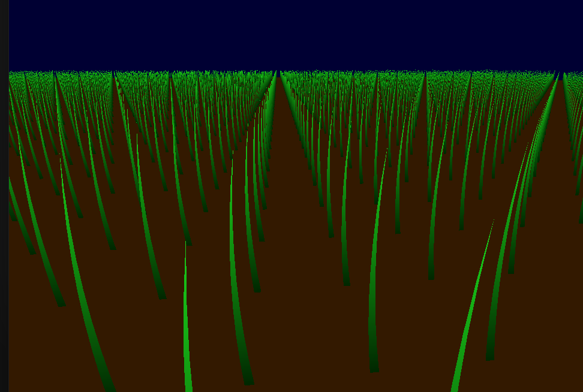

# Computer Graphics II - Homework III
  
## Grass Blade Generation
Generating grass blades from vertices is straightforward with the geometry shader stage. We can just render a simple triangle from the input vertex, a little offset vertex, and a vertex that is at the top of the input vertex with a height of grass blade height we choose. For example, we can do something like this in geometry shader (simplified):

```glsl

#version 460 core
for(int i = 0; i < 3; i++)
{
  vec3 position = fragWorldPos[i];
  vec3 normal = normalize(fragWorldNor[i]);
  vec3 offset = vec3(-0.01, 0.00, 0.00) * pow(2, (bladeHeight * 2));
  vec4 point1 = vec4(position, 1.0);
  gl_Position = projection * view * point1;
  EmitVertex();
  vec4 point2 = vec4(position + offset, 1.0);
  gl_Position = projection * view * point2;
  EmitVertex();
  vec4 point3 = vec4(position + normal * bladeHeight, 1.0);
  gl_Position = projection * view * point3;
  EmitVertex();
  EndPrimitive();
}
```
 
However, as you can see, this would generate very sharp, knife-like grass blades. As we know, grass blades in real life have a curve-like structure. So, we will use bezier curves to generate grass blades to achieve that. 

## Grass Blade Generation with Bezier Curves

Bezier curves are defined by 4 control points, and there is no convention, i.e., we must determine the values with hands so that the resulting grass blades will look real, try and fail approach. My approach is very simple and can be seen in the picture below: 

 

Blade height will be adjustable as the task demands so no need to find a fine value for it, but bezierOffset is not. I determined a basic little offset value and scaled it by the blade height, so the resulting blades would not be too thin when they are too long. 

```glsl
for (int i = 0; i < 3; ++i)
    {
        vec3 position = fragWorldPos[i];
        vec3 normal = normalize(fragWorldNor[i]);
        vec3 bezierOffset = vec3(-0.01, 0.00, 0.00) * pow(2, (bladeHeight * 2));
      
        vec4 p1 = vec4(position, 1.0);
        vec4 p2 = vec4(position + bezierOffset + normal * bladeHeight * 0.333, 1.0);
        vec4 p3 = vec4(position + bezierOffset + normal * bladeHeight * 0.667, 1.0);
        vec4 p4 = vec4(position + normal * bladeHeight, 1.0);
               
        for (int j = 0; j <= 8; ++j)
        {
            vec4 pos = bezier(p1, p2, p3, p4, tVal);
            t = tVal;
            gl_Position = projection * view * pos;
            EmitVertex();

            if (j < 8)
            {
                gl_Position = projection * view * (pos + vec4(0.02 * (1.0 - tVal), 0.0, 0.0, 0.0));
            }
            else
            {
                gl_Position = projection * view * p4;
            }
            EmitVertex();
        }
        EndPrimitive();
    }
```
In the above code piece, tval is used for how far away the fragment is from the root of the grass. We use this tval to shade the grass blades. To be more precise, if the fragments are close to the bottom of the grass, they will be darker,  so the overall look will be like there are shadows in the lower altitude even though there is no implementation for shadows, just a perception trick. Also, the tval is used to determine the fragment's positions. In the previous implementation, we used just 3 pieces, but as we are generating a curve, we must use more fragments to draw. As the fragment altitude gets higher, the offset that is used  will get smaller. So the resulting drawing structure will be like this:

 

And, final grass drawing:

 

## Wind Implementation

Now, we are at the stage where we need to implement the wind. My general idea is that the wind bends the grass blades according to its strength, and the Perlin noise will determine the little vibrations on top of it which is again determined by the wind strength. For the sake of ease, I assumed that the way of the wind lies along the x-axis, so the Perlin noise sampled results will change the x values of the positions of the fragments. Also, I made these changes on the bezier control points instead of changing individual fragments sampled from the bezier curve. 

At first, I embraced the same approach to implement the overall wind influence as the Perlin component, but it made the grass blades longer and longer as the wind strength increased. The problem is obvious, I only changed the x values without decreasing the y value which is simply rotating the control point around the previous one. In the Perlin component, this problem occurs too but as the small vibrations' influence on the position of the control points is too little to notice so I ignored that, however, it is noticeable in the overall wind effect. So, I changed my implementation to rotation instead of translation of x values.

First I calculate the control points, then rotate them according to the wind and finally call the applyWind function which samples from the Perlin noise. 
The resulting implementation: 

```glsl
#version 460 core

layout(triangles) in;
layout(triangle_strip, max_vertices = 18) out;

uniform mat4 view;
uniform mat4 projection;
uniform float bladeHeight;
uniform sampler2D perlin;
uniform float wind;
uniform float time;

in
vec3 fragWorldPos[];
in
vec3 fragWorldNor[];

out
float t;

float k = 0.4;

float alpha(vec4 point1, vec4 point2)
{
    float delta_y = point2.y - point1.y;
    float delta_x = point2.x - point1.x;
    return atan(delta_y, delta_x);
}

float theta(float wind, float k)
{
    return wind * k;
}

float distance(vec4 point1, vec4 point2)
{
    float delta_y = point2.y - point1.y;
    float delta_x = point2.x - point1.x;
    return sqrt(delta_x * delta_x + delta_y * delta_y);
}

float processX(vec4 p1, vec4 p2, float c)
{
    return p2.x + distance(p1, p2) * (cos(alpha(p1, p2) - c * theta(wind, k)) - cos(alpha(p1, p2)));
}

float processY(vec4 p1, vec4 p2, float c)
{
    return p2.y - distance(p1, p2) * (sin(alpha(p1, p2)) - sin(alpha(p1, p2) - c * theta(wind, k)));
}

vec4 applyWind(vec4 position, float influence)
{
    float noise = texture(perlin, position.xy * 0.1 + vec2(time * 0.01)).r;
    return vec4(position.xy + vec2(noise, 0.0) * wind * 0.08 * influence, position.zw);
}


vec4 bezier(vec4 p1, vec4 p2, vec4 p3, vec4 p4, float tval)
{
    float u = 1.0 - tval;
    return (u * u * u * p1)
    + (3.0 * u * u * tval * p2)
    + (3.0 * u * tval * tval * p3)
    + tval * tval * tval * p4;
}

void main()
{
    for (int i = 0; i < 3; ++i)
    {
        vec3 position = fragWorldPos[i];
        vec3 normal = normalize(fragWorldNor[i]);
        vec3 bezierOffset = vec3(-0.01, 0.00, 0.00) * pow(2, (bladeHeight * 2));
               
        vec4 p1 = vec4(position, 1.0);
        vec4 p2 = vec4(position + bezierOffset + normal * bladeHeight * 0.333, 1.0);
        vec4 p3 = vec4(position + bezierOffset + normal * bladeHeight * 0.667, 1.0);
        vec4 p4 = vec4(position + normal * bladeHeight, 1.0);
        
        p2.x = processX(p1, p2, 0.6);
        p2.y = processY(p1, p2, 0.6);
        
        p3.x = processX(p2, p3, 0.8);
        p3.y = processY(p2, p3, 0.8);
        
        p4.x = processX(p3, p4, 1.27);
        p4.y = processY(p3, p4, 1.27);
        
        p2 = applyWind(p2, 0.15);
        p3 = applyWind(p3, 0.35);
        p4 = applyWind(p4, 1.0);
        
        

       
        for (int j = 0; j <= 8; ++j)
        {
            float tVal = float(j) / 8.0;
            vec4 pos = bezier(p1, p2, p3, p4, tVal);
            t = tVal;
            gl_Position = projection * view * pos;
            EmitVertex();

            if (j < 8)
            {
                gl_Position = projection * view * (pos + vec4(0.02 * (1.0 - tVal), 0.0, 0.0, 0.0));
            }
            else
            {
                gl_Position = projection * view * p4;
            }
            EmitVertex();
        }
        EndPrimitive();
    }
}

```
## Results

 

 

 


